# 面向氢储双向运行机制的海上风光氢储一体化发电系统容量协同优化方法

刘沛津1，冯涵蕴1，魏 平2，焦玉婵1，党佳露1，孙艺阁1（1. 西安建筑科技大学 机电工程学院，陕西 西安 710055；2. 国家电网有限公司西北分部，陕西 西安 710048）

摘要：针对海上风光发电波动消纳及氢储系统运行灵活性不足问题，提出一种面向氢储双向运行机制的海上风光氢储一体化发电系统的容量协同优化方法。基于系统拓扑结构构建氢储双向运行框架，考虑海上运行环境及氢储容量状态，建立各子系统数学模型；构建系统容量-运行协同双层优化模型，上层以最小化年均规划成本为目标，涵盖基础建设、设备投资、置换、运维以及输电系统建设成本，下层以最大化典型日运行净收益为目标，统筹售电、碳减排、售氢、购电、弃电、运维等经济指标；为求解该复杂非线性模型，提出结合改进蜣螂优化算法与CPLEX 求解器的混合求解策略，实现容量配置与运行调度的联合优化。通过华东海域进行算例分析，验证所提方法在提升系统经济性、低碳性及运行灵活性方面的协同效应。

关键词：海上风光氢储一体化系统；容量优化配置；氢储双向运行；双层优化模型；混合求解策略中图分类号：TM614 文献标志码：A DOI：10.16081/j.epae.202510020

# 0 引言

在“双碳”目标背景下，海上风电与漂浮式光伏（floating solar photovoltaic，FPV）因其资源互补性与基础设施共享潜力，正逐渐成为海上可再生能源开发的重要形式［1］，但受海洋气象多变性与设备运行耦合性影响，系统仍面临两大问题：风光出力协同偏差将导致较高弃电量；波动功率并网会对系统安全稳定运行造成冲击［2⁃3］。氢能凭借其可将过剩电能转化为高效储存载体的独特优势，成为支撑可再生能源供需平衡、推动能源转型的关键。在此背景下，海上风光氢储一体化发电系统，因其多能互补特性、空间集约等优势，已成为海上可再生能源开发的研究热点。

目前，已有研究开始探索海上风电或光伏与氢能结合的可行性。文献［4］指出，结合海上可再生能源的大规模制氢系统在电价低且氢需求稳定时具备经济可行性。文献［5］提出的海上超导风电制氢一体化技术，有效解决了海上风电的电能消纳与应用效率问题。文献［6］开发的集成海上风能和氢气生产的控制系统提升了系统的经济性。此外，文献［7⁃8］则聚焦于沿海光伏制氢的容量优化问题。文献［9］针对离网型风光耦合制氢系统，通过优化配置碱性-质子交换膜混合电解槽容量，在实现功率平滑、降低系统成本及提升能源利用率方面取得了显著成效。然而，上述研究大多集中于陆上或离网场景下的单一可再生能源制氢技术经济性分析，对于将海上风电和光伏联合制氢，且与氢储能系统深度融合形成一体化系统的研究仍相对较少。

海上风光氢储一体化发电系统内部结构复杂，为保证系统实施经济性和高效运行，需要深入研究其系统的容量配置［10］，文献［11］针对电氢耦合微电网系统容量配置，考虑经济性、环保性等多目标进行优化。文献［12］研究了全生命周期视角下的碳排放效果对风-光-氢多能互补系统优化配置结果影响。但研究多仅将氢储能视为备用单元，未能充分挖掘其在提升整体系统可靠性、灵活性与经济性中的关键作用。具体而言，氢储能不仅可在电力富余时进行电转氢消纳过剩电力，通过电价-氢价博弈产生协同收益，亦可在电力短缺或负荷高峰时氢转电反向供电。这种双向灵活的运行机制，既可作为负荷消纳风光出力，又可作为电源平抑风光波动。文献［13］对在海上进行绿色氢气与电力联合生产的经济性与可靠性进行优化，虽然对海上系统进行分析，但并未考虑FPV受到海洋运行环境影响以及系统分析氢储运行模式对输电系统规划的耦合作用。

因此，本文提出一种面向氢储双向运行机制的海上风光氢储一体化发电系统的容量协同优化方法。主要贡献为：研究了海上风光氢储一体化发电系统拓扑结构，构建了涵盖储氢备用-售氢盈利-返电调峰多模式动态切换的氢储双向运行机制，揭示电价-氢价博弈的协同收益机理；建立了包含波浪作用、水冷作用、海盐沉积等海洋环境影响在内的FPV 出力模型及氢储能系统容量状态动态模型，量化海洋环境对容量的约束效应；构建了系统容量-运行协同双层优化模型，其中，上层模型计入氢储能对输电系统容量的影响，下层模型集成售氢收益、碳减排收益，量化氢储双向运行机制对系统收益贡献，实现规划-运行全局协同。采用改进的蜣螂优化算法（improveddung beetle optimizer，IDBO）与 CPLEX 求解器结合的混合求解策略对双层模型寻优。最后，基于华东海域算例验证了所提方法在提高系统经济性，促进新能源高效利用、多元转化与稳定供应方面的优势，为新能源终端应用场景提供了更广泛的可能性。

# 1 海上风光氢储一体化发电系统拓扑结构与运行机制

海上风光氢储一体化发电系统主要由海上风电场、FPV 电站、换流站、海底电缆以及由电解槽、燃料电池（fuel cell，FC）和储氢罐（hydrogen tank，HT）组成的氢储能系统构成，拓扑结构如附录A图A1所示。该系统可实现风、光、氢3 种清洁能源的动态耦合与时空互补，为海洋可再生能源规模化开发与氢能产业协同发展提供新路径。考虑海上平台空间有限以及技术成熟度，制氢选用组件紧凑、轻便、响应能力快的质子交换膜电解槽（proton exchange membraneelectrolysis cell，PEMEC）。储氢采用高压气态 HT，而发电则使用质子交换膜FC，形成完整的绿电 $^ +$ 绿氢联供体系。海上风光发电通过海底电缆供给陆上负荷，当电力过剩时，PEMEC 电解水制氢，这部分氢气不仅可以就地供给海上用氢负荷，还可以在供电不足时通过FC 向负荷供电。从而增强系统调节能力，促进电-氢能量的双向转换与循环利用。

系统氢储双向运行机制的多模式动态切换架构如下所示。

1）储氢备用模式：当海上风光发电完全匹配负荷需求时，则无须氢储相关设备工作，风光发电将直接供给负荷使用。而当海上风光发电无法直接全部消纳时，富裕电力将被传输至电解槽设备进行制氢，氢气随后送至 进行储存，这一过程不仅有效消纳了过剩的可再生能源，减少了弃风弃光现象，还为后续系统能源调配储备了能量资源。

2）售氢盈利模式：当氢能市场需求旺盛且价格有利时，系统将HT中的氢气出售，实现了电-氢能源转换，从而实现了售氢盈利，提升了系统的经济效益。

3）返电调峰模式：当海上风光发电无法满足电负荷需求时，一体化系统将根据能源需求、电／氢价格、储氢系统容量状态，做出综合决策；或者通过FC将氢气转换回电力，即进行电-氢-电能源转换，以补充电力缺口；或者选择从电网购电弥补电力供应不足。在该模式下，氢储能系统通过“返电”实现对电力系统的调峰功能，保障电力供应与需求的平衡，维持系统的稳定运行。

由此可见，该机制能同时实现电-氢-电循环与电-氢单向转化。前者主要服务于电网调峰需求，后者构建售氢价值链，侧重提升系统经济性，2 种方式通过电价与氢价动态博弈，每一时刻的能量具体转化方式将通过下文数学建模，以寻求最优配置与运行方案而确定，从而确保系统的高效性和经济性。

# 2 海上风光氢储一体化发电系统建模

# 2.1　海上风电机组出力模型

海上风电机组（wind turbines，WT）的出力模型主要与发电机功率特性及轮毂高度处风速有关。

在 $\mathbf { \Phi } _ { t }$ 时刻，WT理论出力为：

$$
P _ { \mathrm { { w r } } } ( t ) = \left\{ \begin{array} { l l } { 0 } & { V ( t ) \leqslant V _ { \mathrm { i n } } \boxplus \bar { \chi } V } \\ { \displaystyle V ^ { 3 } \left( t \right) - V _ { \mathrm { i n } } ^ { 3 } P _ { \mathrm { { w r } } } ^ { \mathrm { { r } } } } & { V _ { \mathrm { i n } } < V ( t ) < V _ { \mathrm { r } } } \\ { \displaystyle V _ { \mathrm { { w r } } } ^ { 3 } } & { V _ { \mathrm { r } } \leqslant V ( t ) < V _ { \mathrm { o u t } } } \end{array} \right.
$$

式中： $P _ { \mathrm { { w T } } } ( t )$ 为 $\mathbf { \Phi } _ { t }$ 时刻WT 理论出力； $P _ { \mathrm { W T } } ^ { \mathrm { r } }$ 为WT 的额定出力； $V ( t )$ 为 $\mathbf { \Phi } _ { t }$ 时刻的轮毂高度处风速； $V _ { \mathrm { i n } }$ 为 WT的切入风速； $V _ { \mathrm { r } }$ 为WT 的额定风速，是WT 以额定功率出力的最小风速； $V _ { \mathrm { o u t } }$ 为WT的切出风速，风速大于切出风速时，WT将处于停机状态。

由于WT 轮毂高度较高，而标准气象风速测量高度通常为 $1 0 \mathrm { m }$ 或 $5 0 \mathrm { m }$ ，因此需要将实测高度处风速归算到轮毂高度处。其计算公式如下：

$$
V ( t ) { = } V _ { \mathrm { { m } } } \bigg ( \frac { H _ { \mathrm { { h u b } } } } { H _ { \mathrm { { m } } } } \bigg ) ^ { a }
$$

式中： $V _ { \mathrm { m } }$ 为实测高度处风速； $H _ { \mathrm { h u b } }$ 为轮毂处高度； $H _ { \mathrm { m } }$   
为实测风速处高度； $\alpha$ 为风切变指数，一般取0.143。

# 2.2　考虑海洋环境的FPV出力模型

2.2.1 规则波浪作用下倾斜面辐照度

漂浮式光伏板出力主要与光照辐射和温度有关。光伏面板均固定安装在浮体上，同步随浮体结构受风浪作用不断摆动。浮体平台运动将影响光伏面板的倾斜角度，从而影响其接收到的太阳辐照度。倾斜面FPV太阳角度如附录A图A2所示。

对于朝向正南的任意倾斜平面，太阳方位角 $\gamma$ 为0，其固定倾斜面太阳辐照度 $D ( t ) ^ { [ 1 4 ] }$ 为：

$$
D ( t ) \mathrm { = } I _ { \mathrm { { D N I } } } t _ { \mathrm { { b } } } + I _ { \mathrm { { D H I } } } \frac { 1 + \cos \beta } { 2 } \mathrm { + } \rho I _ { \mathrm { { G H I } } } \frac { 1 - \cos \beta } { 2 }
$$

$$
t _ { \mathrm { b } } = \frac { \mathrm { c o s } \theta _ { \mathrm { b } } } { \mathrm { s i n } \alpha _ { \mathrm { b } } } = \frac { \sin \left( \varphi - \beta \right) \sin \delta + \cos \left( \varphi - \beta \right) \cos \delta \cos \sigma } { \sin \varphi \mathrm { s i n } \delta + \cos \varphi \mathrm { c o s } \delta \cos \sigma }
$$

式中： $I _ { \mathrm { D N I } }$ 为水平面直接辐照； $t _ { \mathrm { b } }$ 为太阳直射辐射量因子，反映组件倾角对辐射接收效率的影响； $\theta _ { \mathrm { b } }$ 为太阳入射光线与倾斜面法线之间的夹角， $\theta _ { \mathrm { { b } } } { \in } [ 0 ^ { \circ } , 9 0 ^ { \circ } ]$ ，其中 $0 ^ { \circ }$ 表示太阳光线垂直于倾斜面， $9 0 ^ { \circ }$ 表示太阳光线平行于倾斜面； $\alpha _ { \mathrm { b } }$ 为太阳高度角，即太阳光线与水平面的夹角， $\alpha _ { \mathrm { { b } } } { \in } [ 0 ^ { \circ } , 9 0 ^ { \circ } ] ,$ ，其中 $0 ^ { \circ }$ 表示太阳位于地平线， $9 0 ^ { \circ }$ 表示太阳位于天顶； $\varphi$ 为组件安装地纬度；$\beta$ 为倾斜面与水平面夹角； $\delta$ 为赤纬角； $\sigma$ 为时角； $I _ { \mathrm { D H I } }$ 为水平面散射辐照量； $\rho$ 为地面反射率，取 $0 . 0 6 ; I _ { \mathrm { G H I } }$ 为水平面上直射与散射总辐照量，即 $I _ { \mathrm { G H I } } { = } I _ { \mathrm { D N I } } { + } I _ { \mathrm { D H I } } { \circ }$ 。

忽略极端海况，对于规则波下物体的响应，采用艾里波理论描述，将艾里波的波面方程对位置求导后取反正切函数可得艾里波的波倾角时域表达函数［15］，即任意时刻波浪对FPV 影响而导致的组件倾角 $\alpha ( t )$ 变化，如式（5）所示。

$$
\alpha ( t ) { = } \frac { \mathrm { d } \varsigma } { \mathrm { d } x } { = } { - } \mathrm { t a n } ^ { - 1 } \big [ k H \mathrm { s i n } ( k x - \omega t ) \big ]
$$

式中： $H$ 为波浪平均高度； $\scriptstyle { k = 2 \pi / \lambda }$ 为波数， $\lambda$ 为波长；${ \omega } { = } 2 { \pi } / T$ 为波浪圆周频率， $T$ 为波浪周期； $x$ 为水质点水平坐标； $s$ 为波面方程。

考虑到波浪运动导致的FPV发电量变化为时间累积效应，与FPV 的倾角变化程度及其在不同倾角下的持续时间密切相关。为直观量化波浪的影响，引入时均倾角 $\boldsymbol { \varepsilon }$ ，即浮体在波浪作用下运动倾角绝对值的时域平均值［16］。 $\boldsymbol { \varepsilon }$ 的数学表达式为：

$$
\varepsilon { = } \frac { \displaystyle \int _ { T _ { \scriptscriptstyle 1 } } ^ { T _ { \scriptscriptstyle 2 } } \bigr \rvert \alpha ( t ) \left. \mathrm { d } t \right. } { T _ { \scriptscriptstyle 2 } { - } T _ { \scriptscriptstyle 1 } }
$$

式中： $T _ { \scriptscriptstyle 1 }$ 为起始时间点； $T _ { \mathrm { 2 } }$ 为终止时间点。

因此规则波作用下FPV倾角 $\beta ^ { \prime } ( t )$ 为：

$$
\beta ^ { \prime } ( t ) { = } \beta { + } \varepsilon
$$

则规则波作用下倾斜面的辐照度 $D ^ { \prime } ( t )$ 为：

$$
D ^ { \prime } \left( t \right) = I _ { \mathrm { p N I } } t _ { \mathrm { b } } ^ { \prime } + I _ { \mathrm { D H I } } \frac { 1 + \cos \beta ^ { \prime } \left( t \right) } { 2 } +
$$

$$
\rho ( I _ { \mathrm { D N I } } + I _ { \mathrm { D H I } } ) \frac { 1 - \cos \beta ^ { \prime } ( t ) } { 2 }
$$

式中： $t _ { \mathrm { b } } ^ { \prime }$ 为经过 $\beta ^ { \prime } ( t )$ 修正后的太阳直射辐射量因子。

# 2.2.2　水冷作用下光伏组件温度

海水可以降低水面温度，FPV 发电系统效率通常随着温度的升高而降低，因此通过水冷可以提高组件的能量转换效率。对于FPV可以假设光伏电池板的温度与发电期间的环境水温相似［17］。而获取水温相对困难，因此采用对水温影响最大的气温和相对湿度间接确定水温，则水温 $T _ { \mathrm { w } }$ 为：

$$
T _ { \mathrm { w } } { = } 4 . 7 1 7 \mathrm { e } ^ { 0 . 0 4 1 } T _ { \mathrm { a i r } } \frac { ( 1 + r ^ { 2 } ) ^ { 0 . 7 8 1 } } { ( 1 + 0 . 3 2 5 { v _ { \mathrm { ~ w ~ } } } ^ { 2 } ) ^ { 0 . 0 3 2 5 } }
$$

式中： $T _ { \mathrm { a i r } }$ 为气温； $r$ 为相对湿度； $v _ { \mathrm { v } }$ 为水面风速。

2.2.3　海洋环境下发电量损失

在海洋环境复杂的工况下，海盐沉积呈现出不均匀分布的特性，部分区域的积聚程度较高，这种情形可类比为局部遮荫效应。局部遮荫部分不仅会出现显著的温升效应，长时间积累还可能使该单元失效，进而影响整个光伏模块正常运行。

针对上述因海洋环境因素导致的发电量损失，综合考虑FPV 自身的转化效率，引入综合效率修正系数 $K$ 来定量表征海洋环境对FPV 发电量的损失情况。 $K$ 的表达式如式（10）所示。

$$
K \mathrm { = } K _ { \mathrm { \mathrm { s } } } K _ { \mathrm { \mathrm { F P V } } }
$$

式中： $K _ { \mathrm { s } }$ 为海盐沉积造成遮挡导致光伏板效率降低的影响因子，取 $0 . 9 4 8 ^ { [ 1 8 ] }$ ； $K _ { \mathrm { F P V } }$ 为漂浮式光伏板的光伏转化系数。

综上所述，在考虑波浪、水冷、盐积遮挡等海洋环境影响下单个FPV的出力 $P _ { \mathrm { { F P V } } } \left( t \right)$ 为：

$$
P _ { _ { \mathrm { F P V } } } \left( t \right) = P _ { _ { \mathrm { F P V } } } ^ { \mathrm { s r c } } K \frac { D ^ { \prime } \left( t \right) } { D _ { \mathrm { F P V } } ^ { \mathrm { s r c } } } \left[ 1 + \alpha _ { \mathrm { p } } \left( T _ { \mathrm { w } } - T _ { _ { \mathrm { F P V } } } ^ { \mathrm { s r c } } \right) \right]
$$

式中： $P _ { \mathrm { F P V } } ^ { \mathrm { s T C } }$ 为FPV 的标称功率，是在标准测试条件（standard test conditions，STC）下测定的峰值功率；$D ^ { \prime } ( t )$ 为 $\mathbf { \chi } _ { t }$ 时刻规则波作用下倾斜面太阳辐射量； $D _ { \mathrm { F P V } } ^ { \mathrm { s r c } }$ 为STC 下的太阳辐射量； $\alpha _ { \mathrm { { P } } }$ 为功率温度系数； $T _ { \mathrm { F P V } } ^ { \mathrm { S T C } }$ 为STC下的光伏板温度。

# 2.3　氢储能系统容量状态动态模型

本文对工程实际中部分环节进行必要简化，假设氢气就地消纳或销售，忽略其运输、纯化等外送成本以及海水淡化能耗。同时忽略PEMEC 与FC 运行中的温度和溶液浓度变化，视其转化效率恒定，且不计及工作过程中气体泄漏损失。上述简化可能高估了氢储双向运行机制对经济效益的提升，但所揭示的协同优化趋势与机理预计将保持稳健。基于上述简化，氢储能系统的动态过程描述如下，设HT在t时刻的氢气质量为 $H _ { \mathrm { H T } } ( t )$ ，其状态变化依据系统运行模式可以分为以下2种情况。

1）当海上风光出力高于负荷需求时，通过判断HT在t-1时刻氢气质量是否低于其工作上限 $H _ { \mathrm { H T } } ^ { \mathrm { m a x } }$ 来确定在 $\mathbf { \Phi } _ { t }$ 时刻PEMEC 是否工作，若满足条件则工作，否则产生弃电。PEMEC 的输入功率、产氢质量具体表达式如式（12）、（13）所示。

$$
P _ { \mathrm { { E C } } } \left( t \right) { = } P _ { \mathrm { { w T } } } \left( t \right) { + } P _ { \mathrm { { _ { F P V } } } } \left( t \right) { - } P _ { \mathrm { { _ L } } } ( t )
$$

$$
Q _ { \mathrm { { H } } } ^ { \mathrm { { E C } } } ( t ) = \left\{ \begin{array} { l l } { P _ { \mathrm { { E C } } } ( t ) q _ { \mathrm { { H } } } } & { P _ { \mathrm { { E C } } } ^ { \mathrm { { m i n } } } { < } P _ { \mathrm { { E C } } } ( t ) { < } P _ { \mathrm { { E C } } } ^ { \mathrm { { m a x } } } } \\ { P _ { \mathrm { { E C } } } ^ { \mathrm { { m a x } } } q _ { \mathrm { { H } } } } & { P _ { \mathrm { { E C } } } ( t ) { > } P _ { \mathrm { { E C } } } ^ { \mathrm { { m a x } } } } \end{array} \right.
$$

式中： $P _ { \mathrm { E C } } ( t )$ 为 $\mathbf { \Phi } _ { t }$ 时刻PEMEC 输入功率； $P _ { \mathrm { { L } } } ( t )$ 为 $\mathbf { \Phi } _ { t }$ 时刻负荷所需电量； $Q _ { \mathrm { H } } ^ { \mathrm { E C } } \left( t \right)$ 为 $\mathbf { \Phi } _ { t }$ 时刻PEMEC 产氢量； $q _ { \mathrm { H } }$ 为单位电能生产氢气质量，取 $q _ { \mathrm { H } } { = } 0 . 0 1 9 8 \mathrm { k g / ( k W \cdot h ) }$ ；$P _ { \mathrm { E C } } ^ { \mathrm { m a x } } , P _ { \mathrm { E C } } ^ { \mathrm { m i n } }$ 分别为PEMEC 功率上、下限， $P _ { \mathrm { E C } } ^ { \mathrm { m a x } }$ 与 HT 剩余容量有关，如式（14）所示。

$$
P _ { \mathrm { E C } } ^ { \mathrm { m a x } } = \mathrm { m i n } \left\{ P _ { \mathrm { E C } } ^ { \mathrm { r } } , \frac { H _ { \mathrm { H T } } ^ { \mathrm { m a x } } - H _ { \mathrm { H T } } \left( t - 1 \right) } { q _ { \mathrm { H } } } \right\}
$$

式中： $P _ { \mathrm { E C } } ^ { \mathrm { r } }$ 为PEMEC工作额定功率。

2）当海上风光出力低于负荷需求时，须判断HT在 $_ { t - 1 }$ 时刻氢气质量是否高于其工作下限 $H _ { \mathrm { H T } } ^ { \mathrm { m i n } }$ 来确定在 $\mathbf { \Phi } _ { t }$ 时刻FC是否工作，若满足条件则工作，否则须从电网买电。FC 的输出功率 $P _ { \mathrm { { F C } } } ( t )$ 、需氢量 $Q _ { \mathrm { H } } ^ { \mathrm { F C } } ( t )$ 、功率上限 $P _ { \mathrm { F C } } ^ { \mathrm { m a x } }$ 如式（15）—（17）所示。

$$
\begin{array} { r l } & { P _ { \mathrm { _ \mathrm { F C } } } ( t ) { = } P _ { \mathrm { _ L } } ( t ) { - } P _ { \mathrm { _ \mathrm { W T } } } ( t ) { - } P _ { \mathrm { _ \mathrm { F P V } } } ( t ) { - } G _ { \mathrm { _ \mathrm { b u y } } } ( t ) } \\ & { \quad Q _ { \mathrm { H } } ^ { \mathrm { _ \mathrm { F C } } } ( t ) { = } \frac { P _ { \mathrm { _ \mathrm { F C } } } ( t ) } { \eta _ { \mathrm { H } } \eta _ { \mathrm { _ \mathrm { F C } } } } \quad P _ { \mathrm { _ \mathrm { F C } } } ^ { \mathrm { _ \mathrm { m i n } } } { < } P _ { \mathrm { _ \mathrm { F C } } } ( t ) { < } P _ { \mathrm { _ \mathrm { F C } } } ^ { \mathrm { _ { m a x } } } } \\ & { P _ { \mathrm { _ \mathrm { F C } } } ^ { \mathrm { _ { m a x } } } { = } \mathrm { { m i n } } \left\{ P _ { \mathrm { _ \mathrm { F C } } } ^ { \mathrm { _ \mathrm { r } } } , \left[ H _ { \mathrm { _ \mathrm { H T } } } \left( t - 1 \right) - H _ { \mathrm { _ \mathrm { H T } } } ^ { \mathrm { _ { m i n } } } \right] \eta _ { \mathrm { _ H } } \eta _ { \mathrm { _ \mathrm { F C } } } \right\} } \end{array}
$$

式中： $G _ { \mathrm { { b u y } } } \left( t \right)$ 为 $\mathbf { \Phi } _ { t }$ 时刻系统购电量； $\eta _ { \mathrm { { F C } } }$ 为FC 的发电效率； $\eta _ { \mathrm { H } }$ 为单位体积氢气可生产的电量，取 $\eta _ { \mathrm { H } } =$ $3 3 . 5 8 \ : \mathrm { ( k W \cdot h ) } \ : / \mathrm { k g } ; P _ { \mathrm { F C } } ^ { \mathrm { m i n } }$ 为FC 的功率下限； $P _ { \mathrm { F C } } ^ { \mathrm { r } }$ 为 FC的额定功率。

综上，可得 $\mathbf { \Phi } _ { t }$ 时刻HT的容量状态模型为：

$H _ { \mathrm { H T } } \left( t \right) = H _ { \mathrm { H T } } \left( t - 1 \right) - S _ { \mathrm { H _ { 2 } } } \left( t \right) + Q _ { \mathrm { H } } ^ { \mathrm { E C } } \left( t \right) - Q _ { \mathrm { H } } ^ { \mathrm { F C } } \left( t \right)$ 式中： $S _ { \mathrm { H } _ { 2 } } ( t )$ 为 $\mathbf { \Phi } _ { t }$ 时刻售氢量。

结合氢储能双向运行机制及以上氢储能系统容量状态动态模型，某典型日该机制下系统的能量流过程如附录A图A3所示。

# 3 海上风光氢储一体化发电系统容量-运行协同双层优化模型

# 3.1 双层优化模型

为解析海上风光氢储一体化发电系统中复杂能量流转换关系，实现容量-运行协同优化，构建双层优化模型。将考虑年均的长时间尺度规划问题于上层优化过程中求解，将考虑典型日短时间尺度的运行问题放在下层优化中进行求解，同时计及多种影响因素，使得规划问题更加全面和贴近实际。双层优化模型框架如附录A图A4所示。

# 3.2　上层容量协同优化模型

# 3.2.1 目标函数

上层优化模型的决策变量为系统内所有设备容量，优化目标 $\boldsymbol { F } _ { 1 }$ 为系统年均总规划成本 $C _ { \mathrm { T } }$ 最小，具体表达式如下：

式中： $C _ { \mathrm { f i x } }$ 为系统的基础设施年均建设成本； $C _ { \mathrm { i n v } }$ 为系统内设备年均投资成本； $C _ { \mathrm { t r a n s } }$ 为海上输电系统年均建设成本； $C _ { \mathrm { r e p } }$ 为系统内设备年均置换成本； $C _ { \mathrm { o m } }$ 为系统内设备年均运行维护成本。

1）基础设施年均建设成本 $C _ { \mathrm { f i x } }$ 。

$C _ { \mathrm { f i x } }$ 随着装机容量的变化而变化，表达式为：

$$
C _ { _ { \mathrm { f i x } } } = \frac { i ( 1 + i ) ^ { y } } { ( 1 + i ) ^ { y } - 1 } C _ { _ { \mathrm { f i x } _ { - } \mathrm { r } } } \sum _ { j } ^ { 5 } R _ { j }
$$

式中： $C _ { \mathrm { f i x \_ r } }$ 为单位容量基础设施建造费用，取515.280 元／kW； $i$ 为贴现率，取 $0 . 0 5 ; y$ 为一体化系统的运行寿命，取 $2 5 \mathrm { a } ; R _ { j }$ 为各设备容量，其中 $j { = } 1$ 表示 WT， $j { = } 2$ 表示 FPV， $j { = } 3$ 表示 PEMEC， $j { = } 4$ 表示FC， $j { = } 5$ 表示 $\mathrm { H T }$ 。

2）设备年均投资成本C 。

$$
C _ { \mathrm { i n v } } = \frac { i ( 1 + i ) ^ { y } } { ( 1 + i ) ^ { y } - 1 } \sum _ { j } ^ { 5 } ( R _ { j } C _ { j } )
$$

式中： $C _ { j }$ 为各设备单位容量投资成本。

3）海上输电系统年均建设成本。

并网拓扑采用基于模块化多电平换流器的柔性 直流输电系统（modular multilevel converter-highvoltage direct current，MMC-HVDC），电 压 等 级 为$\pm 2 2 0 \ \mathrm { k V }$ 。假设换流站具备足够的无功调节能力，并将输电系统成本视为与容量和距离相关的函数。单位容量输电系统建设成本 $C _ { \mathrm { t r a n s } } ^ { \mathrm { c } }$ 、陆上和海上换流站建设成本 $C _ { \mathrm { H V D C } } ^ { \mathrm { o n s h o r e } }$ 和 $C _ { \mathrm { H V D C } } ^ { \mathrm { o f f s h o r e } }$ 分别如式（22）、（23）所示。

$$
\begin{array}{c} C _ { \mathrm { t r a n s } } = \frac { i ( 1 + i ) ^ { y } } { ( 1 + i ) ^ { y } - 1 } \ ( L R _ { \mathrm { t r a n s } } C _ { \mathrm { t r a n s } } ^ { \mathrm { c } } + C _ { \mathrm { H V D C } } ^ { \mathrm { o n s h o r e } } + C _ { \mathrm { H V D C } } ^ { \mathrm { o f s h o r e } } )  \\ { \left\{ \begin{array} { l l } { C _ { \mathrm { H V D C } } ^ { \mathrm { o n s h o r e } } = 1 . 3 6 8 + 2 . 0 5 2 \frac { R _ { \mathrm { t r a n s } } } { 3 0 0 } } \\ { C _ { \mathrm { H V D C } } ^ { \mathrm { o f s h o r e } } = 1 . 9 0 0 + 3 . 8 0 0 \frac { R _ { \mathrm { t r a n s } } } { 3 0 0 } } \end{array} \right. } \end{array}
$$

式中： $R _ { \mathrm { t r a n s } }$ 为海上输电系统容量； $L$ 为海缆长度，取$8 0 \mathrm { k m }$ 。

4）设备年均置换成本C 。

$$
C _ { \mathrm { r e p } } = \frac { i ( 1 + i ) ^ { y } } { ( 1 + i ) ^ { y } - 1 } \Bigg ( \sum _ { n \in \mathcal { Q } _ { \mathrm { r c } } } \frac { R _ { \mathrm { F C } } C _ { \mathrm { r e p } } ^ { \mathrm { F C } } } { ( 1 + i ) ^ { n } } + \sum _ { n \in \mathcal { Q } _ { \mathrm { r c } } } \frac { R _ { \mathrm { E C } } C _ { \mathrm { r e p } } ^ { \mathrm { E C } } } { ( 1 + i ) ^ { n } } + \sum _ { n \in \mathcal { Q } _ { \mathrm { r r } } } \frac { R _ { \mathrm { H T } } C _ { \mathrm { r e p } } ^ { \mathrm { H T } } } { ( 1 + i ) ^ { n } } \Bigg )
$$

式中： $C _ { \mathrm { r e p } } ^ { \mathrm { F C } } \setminus C _ { \mathrm { r e p } } ^ { \mathrm { E C } } \setminus C _ { \mathrm { r e p } } ^ { \mathrm { H T } }$ 分别为FC、PEMEC、HT 单位容量更换成本； $n$ 为设备更换年份； $\Omega _ { \mathrm { F C } } \Omega _ { \mathrm { E C } } \Omega _ { \mathrm { H T } }$ 分别为FC、PEMEC、HT更换年份的集合。

5）设备年均运行维护成本。

$C _ { \mathrm { o m } }$ 取决于系统各设备出力的固定运维成本及因海洋环境所增加的额外运维成本，其固定运维成本由下层协同运行优化求得，具体如式（25）所示。

$$
\left\{ \begin{array} { l l } { C _ { \mathrm { o m } } { = } 3 6 5 C \mathrm { _ { o m } ^ { d } } { + } C _ { \mathrm { d } } { + } C _ { \mathrm { c } } } \\ { C _ { \mathrm { d } } { = } \alpha _ { \mathrm { d } } t _ { \mathrm { d } } c _ { \mathrm { d } } R _ { \mathrm { 1 } } } \\ { C _ { \mathrm { c } } { = } c _ { \mathrm { c } } R _ { \mathrm { 2 } } } \end{array} \right.
$$

式中： $C _ { \mathrm { o m } } ^ { \mathrm { d } }$ 为典型日下系统主要设备运行维护成本；$C _ { \mathrm { d } }$ 为年均因台风导致风机停机损失成本； $\alpha _ { \mathrm { d } }$ 为因台风导致风机停机概率，取1.2 次／ $\mathrm { \hat { \Pi } } _ { \mathrm { a } ; t _ { \mathrm { d } } }$ 为停机时长，取 $7 2 \mathrm { h } ; c _ { \mathrm { d } }$ 为单位停机损失成本，取0.5元／ $\left( \mathrm { k W \cdot h } \right)$ ；$C _ { \mathrm { c } }$ 为年均FPV清洗费用，其清洗频率为3次 $/ \mathrm { a } { ; } c _ { \mathrm { c } }$ 为年均单位FPV清洗费用，取1.02元／ $( \mathrm { k W \cdot h } ) ^ { [ 1 9 ] }$ 。

# 3.2.2 约束条件

由于项目场地、投资费用限制，上层模型中各设备容量上下限约束具体表达式见附录A式（A1）。

# 3.3 下层运行协同优化模型

3.3.1 目标函数

下层优化模型的决策变量为各设备出力以及购／售电／售氢量，目标函数 $F _ { _ 2 }$ 为系统典型日运行净收益 $I ^ { \mathrm { d } }$ 最大，函数表达式为：

$$
I ^ { \mathrm { d } } { = } I _ { \mathrm { s e l l } } ^ { \mathrm { d } } { + } I _ { \mathrm { H _ { 2 } } } ^ { \mathrm { d } } { + } I _ { \mathrm { c c E R } } ^ { \mathrm { d } } { - } C _ { \mathrm { b u y } } ^ { \mathrm { d } } { - } C _ { \mathrm { o m } } ^ { \mathrm { d } } { - } C _ { \mathrm { c u r t } } ^ { \mathrm { d } }
$$

式中： $I _ { \mathrm { s e l l } } ^ { \mathrm { d } } \setminus I _ { \mathrm { H _ { 2 } } } ^ { \mathrm { d } }$ 分别为典型日售电、售氢收益； $I _ { \mathrm { C C E R } } ^ { \mathrm { d } }$ 为典型日碳减排收益； $C _ { \mathrm { b u y } } ^ { \mathrm { d } }$ 为系统典型日从电网购电成本； $C _ { \mathrm { o m } } ^ { \mathrm { d } }$ 为系统典型日各设备因出力产生的运维费用； $C _ { \mathrm { c u r t } } ^ { \mathrm { d } }$ 为系统典型日弃电惩罚成本。

1）典型日碳减排收益 $I _ { \mathrm { C C E R } } ^ { \mathrm { d } }$ 。一体化系统碳减排收益源于碳市场交易机制，由于系统本身碳排放近乎为0，其产生的清洁电力与绿色氢气可转化为大量的碳配额或减排量用于出售获利，碳减排收益 $I _ { \mathrm { C C E R } } ^ { \mathrm { d } }$ 的具体表达式为：

$$
\begin{array} { r } { I _ { \mathrm { c C E R } } ^ { \mathrm { d } } = P _ { \mathrm { c o _ { 2 } } } \Bigg [ c _ { \mathrm { e } } \sum _ { t = 1 } ^ { 2 4 } ( P _ { \mathrm { L } } ^ { \mathrm { d } } ( t ) - G _ { \mathrm { b u y } } ^ { \mathrm { d } } \left( t \right) ) + } \\ { c _ { \mathrm { H _ { 2 } } } \displaystyle \sum _ { t = 1 } ^ { 2 4 } S _ { \mathrm { H _ { 2 } } } ^ { \mathrm { d } } \left( t \right) - c _ { \mathrm { c o _ { 2 } } } \displaystyle \sum _ { t = 1 } ^ { 2 4 } G _ { \mathrm { b u y } } ^ { \mathrm { d } } \left( t \right) \Bigg ] } \end{array}
$$

式中： $P _ { \mathrm { { C O } _ { 2 } } }$ 为碳交易价格； $P _ { \mathrm { L } } ^ { \mathrm { d } } ( t ) , G _ { \mathrm { b u y } } ^ { \mathrm { d } } ( t ) , S _ { \mathrm { H _ { 2 } } } ^ { \mathrm { d } } ( t )$ 分别为典型日 $\mathbf { \Phi } _ { t }$ 时刻系统供电量、购电量、售氢量； $c _ { \mathrm { e } }$ 为单位绿电碳排放配额； $c _ { \mathrm { H } _ { 2 } }$ 为绿氢代替灰氢碳减排量； $c _ { \mathrm { c o } _ { 2 } }$ 为从电网购电间接单位碳排放量。

2）典型日售电收益I sdell与售氢收益I Hd。

以海上风光发电供负荷电量计算售电收益，HT在容量富余时根据氢价驱动将氢气供给用氢负荷，以这部分售氢量计算售氢收益。具体表达式为：

$$
\begin{array} { c } { { \displaystyle { I _ { \mathrm { s e l l } } ^ { \mathrm { d } } = \sum _ { t = 1 } ^ { 2 4 } \Big [ p _ { \mathrm { \ s e l l } } \big ( t \big ) \big ( P _ { \mathrm { L } } ^ { \mathrm { d } } \big ( t \big ) - G _ { \mathrm { \mathrm { b u y } } } ^ { \mathrm { d } } \big ( t \big ) \big ) \Big ] } } } \\ { { \displaystyle { I _ { \mathrm { H } _ { \mathrm { 2 } } } ^ { \mathrm { d } } = \sum _ { t = 1 } ^ { 2 4 } p _ { \mathrm { \ H } _ { \mathrm { 2 } } } S _ { \mathrm { H } _ { \mathrm { 2 } } } ^ { \mathrm { d } } \big ( t \big ) } } } \end{array}
$$

式中： $p _ { \mathrm { s e l l } } \left( t \right)$ 为分时售电价； $p _ { \mathrm { H } _ { 2 } }$ 为售氢价格。

3）典型日购电成本 $C _ { \mathrm { b u y } } ^ { \mathrm { d } }$

$$
C _ { \mathrm { b u y } } ^ { \mathrm { d } } { = } p _ { \mathrm { b u y } } ( t ) \sum _ { t = 1 } ^ { 2 4 } G _ { \mathrm { b u y } } ^ { \mathrm { d } } ( t )
$$

式中： $p _ { \mathrm { b u y } } ( t )$ 为分时购电价。

4）典型日系统运维成本 $C _ { \mathrm { o m } } ^ { \mathrm { d } }$

$$
C _ { \mathrm { o m } } ^ { \mathrm { d } } { = } \sum _ { t = 1 } ^ { 2 4 } \bigl ( P _ { \mathrm { w r } } ( t ) C _ { \mathrm { o m } } ^ { \mathrm { w r } } { + } P _ { \mathrm { _ { F P V } } } ( t ) C _ { \mathrm { o m } } ^ { \mathrm { F P V } } { + }
$$

$$
P _ { \mathrm { E C } } ( t ) C _ { \mathrm { o m } } ^ { \mathrm { E C } } \mathrm { + } P _ { \mathrm { F C } } ( t ) C _ { \mathrm { o m } } ^ { \mathrm { F C } } \Big )
$$

式中： $C _ { \mathrm { o m } } ^ { \mathrm { W T } } \setminus C _ { \mathrm { o m } } ^ { \mathrm { F P V } } \setminus C _ { \mathrm { o m } } ^ { \mathrm { E C } } \setminus C _ { \mathrm { o m } } ^ { \mathrm { F C } }$ 分别为各设备的单位时间运行维护费用。

5）典型日弃电惩罚成本 $C _ { \mathrm { c u r t } } ^ { \mathrm { d } }$

$$
C _ { \mathrm { c u r t } } ^ { \mathrm { d } } { = } p _ { \mathrm { c u r t } } { \sum _ { t = 1 } ^ { 2 4 } } P _ { \mathrm { c u r t } } ^ { \mathrm { d } } \left( t \right)
$$

式中： $p _ { \mathrm { c u r t } }$ 为单位长度弃电惩罚费用； $P _ { \mathrm { c u r t } } ^ { \mathrm { d } } \left( t \right)$ 为典型日 $\mathbf { \Phi } _ { t }$ 时刻系统弃电量。

# 3.3.2 约束条件

约束条件包括PEMEC 与FC 启停与功率约束、HT 容量约束、海上风光出力约束、功率平衡约束、弃电量约束、购电量约束，具体表达式见附录A 式（A2）—（A9）。

# 3.4　双层优化模型混合求解策略

针对所建双层优化模型，提出混合求解策略，上层采用融合Circle 混沌映射、黄金正弦策略、非线性边界收敛因子的IDBO进行求解，避免传统算法收敛速度慢、易陷入局部最优的问题。下层基于系统能量流分析，运用 MATLAB 平台使用 YALMIP 调用CPLEX 求解器进行高效求解。年均规划成本作为上层IDBO 的适应度，通过不断迭代，直至找到最优容量和最低年均规划成本。具体改进策略及IDBO的测试与验证见附录B。双层优化模型混合求解策略流程如图1所示。

开始 下层优化（CPLEX求解器）  
输入典型日负荷、海上 更新下层运行模型  
风光出力、设备参数、 约束条件能源价格等参数初始化参数：种群 YALMIP调用CPLEX  
大小、迭代次数、决策 求解下层运行模型  
变量、目标函数数量Circle混沌初始化 计算目标函数蜣螂种群 获得最优运行计划获得配置方案体化系统运行计划计算目标函数更新蜣螂位置更新蜣螂位置N计算目标函数及满足终止条件？当前最优位置Y上层优化(IDBO)结束

# 4 算例分析与验证

# 4.1 基础数据

本文以华东某海域（离岸 $8 0 ~ \mathrm { k m }$ 、水深 $2 0 ~ \mathrm { m }$ ）年气象数据为基础，采样时间间隔1 h，具体分布见附录C 图C1。一体化发电系统其他关键参数见附录C表 C1 — $\mathrm { C } 3 ^ { [ 2 0 - 2 1 ] }$ 。碳交易价格取0.07元 $/ \mathrm { k g }$ ；绿电碳排放配额取 $0 . 5 7 0 3 \mathrm { ~ k g / ~ ( \ k W \cdot h ) ~ }$ ；电网购电的间接单位碳排量取 $0 . 9 4 1 ~ \mathrm { k g } \times \mathrm { ( k W } \cdot \mathrm { h ) }$ ；按照国内氢能生产结构以及制氢方式的碳排放强度计算绿氢碳减排量，为 $2 0 \mathrm { k g / k g }$ ，即每生成 $1 \mathrm { k g }$ 绿氢，相较于生产$1 \mathrm { k g }$ 灰氢其二氧化碳减排量为 $2 0 \mathrm { k g }$ ；绿氢的售价为40 元／ $\mathrm { k g } ^ { [ 2 2 ] }$ 。

# 4.2　场景生成与方案设计

根据2.1、2.2节海上风、光出力公式，采用改进的迭 代 自 组 织 数 据 分 析 算 法（iterative self-organizingdata analysis technique algorithm，ISODATA）对全年气象数据进行分析，同时考虑海上风光出力场景概率与相关性生成海上风光联合出力的典型日，具体流程如附录 图 所示，典型日电负荷以及海上风光联合出力见附录C图C3所示，用于双层优化分析。

为了探究考虑海上输电成本以及售氢盈利模式中售氢收益对于系统容量协同优化结果的影响，本文设置4 种不同仿真方案进行比较，如附录C 表C4所示，实现更全面的优化系统设计分析。

方案1：不考虑海上输电系统建设成本与海洋额外运行成本，采用返电调峰的氢储电-氢-电转换运行机制。此方案涉及场景为基准场景。

方案2：在方案1的基础上考虑海上输电系统建设成本。与方案4 对比，验证售氢盈利及返电调峰对系统的经济性与稳定性影响。

方案3：采用本文所提含储氢备用-售氢盈利-返电调峰模式的氢储双向运行机制，但系统中未配置FPV。与方案4对比，分析海上风光互补效果。

方案4：考虑海上输电系统建设成本以及海洋额外成本，采用含储氢备用-售氢盈利-返电调峰模式的氢储双向运行机制，使系统更贴合实际海上运行情况，即为本文所提容量协同配置方法。

# 4.3 协同优化结果分析

根据算例提供参数，采用3.4节混合求解策略对双层模型进行协同优化求解，设定IDBO初始种群数量为50，最大迭代次数为100，设置仿真优化实验次数为30次，各方案平均优化配置结果如表1所示，成本、收益构成如图2、3所示。

7115.536836.12 75006507.786474.4360004500元2 302.72063.28 2294.57 1665.25 3000万1629.351442.15 15001446.71 1125.19 367.70380.80587.51 454.60 355.65 387.94 0Cinv 357.93 方案4Ctrans 成本 omC /rep Cfi 方案1 方案2 方案3 方案

为验证混合求解策略在实际规划问题中的求解优越性，采用DBO（蜣螂算法）与IDBO 对方案4进行求解，仿真优化结果分析详见附录D。

为综合对比系统规划-运行过程中整体经济效益，将系统日运行净收益统一至年运行净收益，定义系统年均净利润为年运行净收益与年均规划成本之差。由表1可知，采用IDBO的配置结果优于DBO，年均净利润增加了210.07万元，具有更好的经济效益。

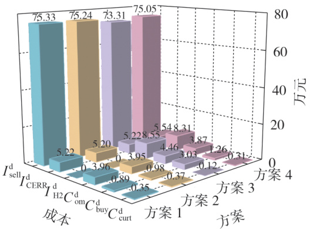  
图2　不同方案系统年均规划成本构成 Fig.2　Composition of average annual planning costs for different program systems   
图3　不同方案系统日运行净收益构成Fig.3 Composition of net daily operational benefitsfor different program systems

# 4.3.1　海上输电系统建设成本影响分析

方案2 在方案1 的基础上考虑了海上输电系统建设成本，年均规划成本增加 $2 3 . 9 2 \%$ ，这表明输电系统建设对一体化系统经济影响显著，若忽略则将高估项目整体收益，产生偏差风险。此外海上输电系统的建设不仅改变了容量配置策略，还使购／弃电成本增加，主要归因于输电系统成本高昂，系统为减少输电上岸功率，将WT、FPV、PEMEC、FC 的容量下调以维持成本最优，这证实了输电基础设施规划与源储配置存在强耦合关系。方案1 的运行策略如附录E图E1所示。

# 4.3.2 氢储双向运行机制影响分析

相较于方案 ，虽然方案 因投资成本与海洋额外运维成本使年均规划成本提升，但通过引入售氢环节以满足多种能源负荷需求后，年均净利润提升$1 5 . 1 8 \%$ ，其中售氢收益为8.31 万元，同时弃电成本降低与碳减排收益增加。当前氢能市场的经济效益将驱动系统优化配置，使WT、FPV、PEMEC 的容量分别增加，而降低FC、HT 投入。表明售氢盈利的氢能直供方式会降低返电调峰模式应用，以最大化系统运行收益。输电系统容量的降低，表明海上风光氢储一体化系统，可通过制氢出售的绿氢直供模式降低海底电缆／换流站投资。

表1 30次仿真平均优化配置结果  
Table 1 Optimized configuration results averaged over 30 simulations   

<html><body><table><tr><td rowspan="2">方案</td><td rowspan="2">算法</td><td colspan="10">配置结果</td></tr><tr><td>WT/kW</td><td>FPV/kW</td><td>PEMEC/kW</td><td>FC/kW</td><td>HT / kg</td><td>海上输</td><td>年均规万元</td><td>运行净收</td><td>年均净元润/</td></tr><tr><td>1</td><td>IDBO</td><td>55318</td><td>25008</td><td>11670</td><td>4872</td><td>1033</td><td></td><td>8 899.93</td><td>75.35</td><td>18 602.82</td></tr><tr><td>2</td><td>IDBO</td><td>55 238</td><td>24960</td><td>11 626</td><td>4430</td><td>1030</td><td>68539</td><td>11 029.53</td><td>75.14</td><td>16 396.57</td></tr><tr><td>3</td><td>IDBO</td><td>65 830</td><td></td><td>27708</td><td>11325</td><td>1247</td><td>61115</td><td>12 311.29</td><td>79.47</td><td>16 695.26</td></tr><tr><td>4</td><td>DBO</td><td>57205</td><td>27775</td><td>16210</td><td>2522</td><td>286</td><td>68439</td><td>11 659.61</td><td>83.11</td><td>18 675.54</td></tr><tr><td></td><td>IDBO</td><td>57319</td><td>27973</td><td>15977</td><td>2536</td><td>350</td><td>68297</td><td>11 544.44</td><td>83.37</td><td>18885.61</td></tr></table></body></html>

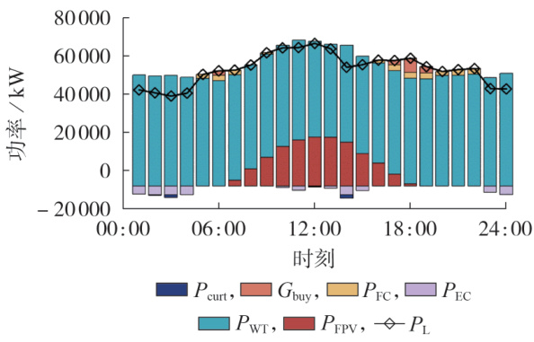  
方案2、方案4的运行策略如图4、5所示。

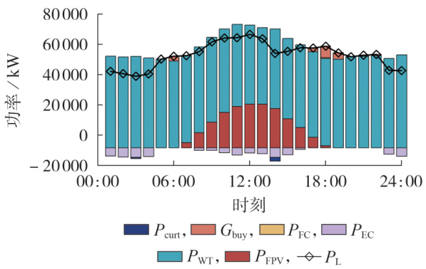  
Fig.4　Typical day running strategy for Scenario 2   
图5　方案4的典型日运行策略  
Fig.5　Typical day running strategy for Scenario 4

由图2、4 可以分析售氢环节的加入，对系统运行策略的影响。方案2 调度FC 返电调峰量大于方案 4，如在 17:00 — 20:00 时，WT 与 FPV 发电不足以应对晚高峰负荷需求，由于不考虑售氢，系统优先采用FC发电以平衡功率，但长时间的功率缺额可能会导致HT容量持续下降，迫使系统向电网购电。而在方案4 中，基于售氢经济性考虑，系统优先选择从电网购电以填补缺额，当负荷缺额超过最大购电量时再采用FC 发电进行调峰。FC 发电量的减少与系统购电量的增加，反映出在当前经济技术条件下，系统更倾向于采用售氢盈利模式的电-氢转换方式，出售更多氢气，而将返电调峰作为备用保障手段。该运行策略与配置优化结果相一致。方案4 氢储能系统的HT充放情况以及容量变化如附录E图E2所示。

# 4.3.3　海上风光互补发电影响分析

对比方案3 与方案4，加入FPV 后，系统年均净利润增加2 190.35 万元。通过合理配置价格相对较低的FPV 与WT 进行互补发电，能有效减少高昂WT投入。同时FPV 与WT 通过时空互补特性降低系统备用需求，使得氢储能设备容量减少，进而显著减少设备投资成本与置换成本。该结果验证了风光互补发电在海上新能源系统中技术经济性优势，方案3的运行策略如附录E图E3所示。

# 4.4 敏感性分析

在海上一体化发电系统的决策过程中，经济参数对配置与运行策略具有决定性影响。为探究关键变量对系统经济性与设备容量的敏感度，本文以氢气售价为变量，在基准值基础上设定 $[ - 6 0 \% , 3 0 \% ]$ 的浮动区间进行敏感性分析，结果如图6所示。

由图可知，随着氢价上涨，为充分利用可再生能源制氢，系统倾向于配置更多的WT 与FPV，同时显著提升PEMEC 的配置规模。相应地，FC 与HT 的容量因外售氢气而有所下降。输电系统容量受风光资源条件与陆上负荷刚性需求的双重约束，其变化幅度相对有限。当氢价涨幅超过 $1 5 \%$ 后，各设备容量逐渐趋于稳定，表明系统运行策略逐步接近可行域的边界，配置结构趋于收敛。从系统经济性角度看，氢价上涨虽然将导致系统年均规划成本增加，但售氢收益显著提升，系统整体净收益仍呈增长趋势。附录E 图E4 进一步展示了不同氢价下的成本与收益构成。当氢价上升 $30 \%$ 时，系统配置更多新能源机组，售电收益与弃电成本同步增加，反映了系统在追求高氢价收益时的运行特征。

可见，氢价的上涨将进一步促使系统在氢储双向运行机制下选择售氢盈利模式，可能会减少氢能作为返电调峰的储能资源使用，而随着氢价下调，返电调峰模式利用率逐渐提升。因此，合理的氢价定价对促进氢储双向运行机制的有效利用至关重要。

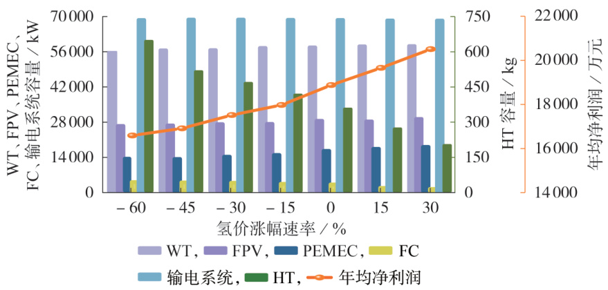  
图4　方案2的典型日运行策略  
图6　氢价波动影响  
Fig.6　Fluctuations impact of hydrogen price

通过科学的定价策略，可以引导系统在不同的市场环境下灵活选择合适的运行模式，实现系统经济效益和供电可靠性的双目标。

# 5 结论

本文构建了在氢储双向运行机制下，融合输电系统成本与售氢收益的海上风光氢储一体化发电系统容量- 运行协同双层优化模型，采用 IDBO 与CPLEX 求解器的混合求解策略实现了容量协同优化。算例分析表明，所建模型在提升经济性方面具有显著优势，所得结论如下。

1）氢储双向运行机制中的售氢盈利模式，在满足输电容量刚性约束下，有效提升了系统整体经济性。该机制可使海上输电系统容量平均降低约$2 4 2 \mathrm { k W }$ ，验证了售氢行为对缓解输电压力的积极作用。尽管台风停机损失及FPV清洗成本增加了系统的年均运维成本，但该设定更贴近海上实际工况，增强了结论的工程参考价值。同时，利用电价-氢价套利，系统年均利润提升 $1 5 . 1 8 \%$ ，显著改善了系统的经济性。弃电量降低 $1 6 . 2 2 \%$ ，优化了整体能量利用效率；此外，碳减排收益也提升 $4 . 8 0 \%$ ，体现了良好的低碳环保效益。

2）在当前经济技术条件下，海上一体化发电系统的氢储双向运行机制中，返电调峰模式使用率低于售氢盈利模式使用率，原因主要有：当前PEMEC与FC 的转换效率较低，导致二次能量损失；现阶段PEMEC 与FC 价格较高，利用其反向调峰不如直接售氢经济。系统仅在负荷缺额超过购电限额时启动FC 发电，反映了能量流向决策的市场敏感性。但返电调峰模式在极端工况下削峰填谷对系统稳定性保障仍具有不可替代的价值。未来，随着PEMEC 与FC 技术的不断进步，转换效率有望大幅提升，设备成本也将逐渐降低，经济性和实用性将显著增强。

3）与传统DBO 相比，基于Circle 混沌映射、黄金正弦策略、非线性边界收敛因子相结合的IDBO算法在测试函数上收敛速度更快，全局搜索能力更强，且在容量协同规划问题中表现优于DBO。

本文对氢储双向运行机制在海上一体化发电系统容量协同优化提升中的作用机理进行了初步探讨，为提升规划设计的精准性与实用性，构建更为完善的海上风光氢储一体化技术体系。后续研究可从以下方面深入展开：一方面，须构建涵盖氢能“制-储-运-用”全链条的综合经济性模型，揭示外送成本等因素对系统优化格局的影响；另一方面，应量化海洋严苛环境对设备寿命与运维成本的实际影响，增强系统经济性分析可靠性。

附录见本刊网络版（http：∥www.epae.cn）。

# 参考文献：

［1］ ALI F，ETEMAD-SHAHIDI A，STEWART R A，et al. Co-locatedoffshore wind and floating solar farms：a systematic quantitativeliterature review of site selection criteria［J］. Renewable Ener-gy Focus，2024，50：100611.  
［2］李明轩，范越，汪莹，等. 新能源大基地风光储容量协调优化配置［J］. 电力自动化设备，2024，44（3）：1-8.LI Mingxuan，FAN Yue，WANG Ying，et al. Coordinated optimalconfiguration of wind-photovoltaic-energy storage capacity forlarge-scale renewable energy bases［J］. Electric Power Automa⁃tion Equipment，2024，44（3）：1-8.  
［3］KHURSHID H，MOHAMMED S B，YACOUBY A M A，et al.Analysis of hybrid offshore renewable energy sources for powergeneration：a literature review of hybrid solar，wind，and wavesenergy systems［J］. Developments in the Built Environment，2024，19：100497.  
［4］ KUMAR S，BAALISAMPANG T，ARZAGHI E，et al. Synergyof green hydrogen sector with offshore industries：opportunitiesand challenges for a safe and sustainable hydrogen economy［J］. Journal of Cleaner Production，2023，384：135545.  
［5］申刘飞，翟雨佳，吴星徵，等. 海上超导风电制氢一体化研究进展与发展趋势［J］. 电工技术学报，2025，40（11）：3362-3380.SHEN Liufei，ZHAI Yujia，WU Xingzheng，et al. Progress anddevelopment trend of integrated research on hydrogen produc⁃tion from offshore superconducting wind power［J］. Transac⁃tions of China Electrotechnical Society，2025，40（11）：3362-3380.  
［6］ EGELAND-ERIKSEN T，SARTORI S. Techno-economic analysisof the effect of a novel price-based control system on thehydrogen production for an offshore 1.5 GW wind-hydrogen sys-tem［J］. Energy Reports，2024，11：2633-2655.  
［ 7］ TEMIZ M，DINCER I. Techno-economic analysis of green hy-drogen ferries with a floating photovoltaic based marine fue-ling station［J］. Energy Conversion and Management，2021，247：114760.  
［8］GHARIBVAND H，GHAREHPETIAN G B，ANVARI-MOGHA-DDAM A. Feasibility studies of green hydrogen productionusing photovoltaic systems in Iran’s southern coastal regions［J］. International Journal of Hydrogen Energy，2024，94：1212-1223.  
［9］徐衍会，李冠霖. 基于碱性-质子交换膜混合电解槽的离网型风光耦合制氢系统容量配置优化［J］. 电力自动化设备，2025，45（4）：1-9.XU Yanhui，LI Guanlin. Capacity configuration optimizationof off-grid wind-solar coupling hydrogen production systembased on alkaline-proton exchange membrane hybrid electro⁃lyzers［J］. Electric Power Automation Equipment，2025，45（4）：1-9.  
［10］ EL-SATTAR H A，KAMEL S，ELSEIFY M A. A modified whiteshark optimizer for optimizing photovoltaic，wind turbines，bio-mass，and hydrogen storage hybrid systems［J］. Journal ofEnergy Storage，2025，113：115655.  
［11］李远征，任潇，葛磊蛟，等. 基于可逆固体氧化物电池的电氢耦合微电网全生命周期规划-运营研究［J］. 中国电机工程学报，2024，44（13）：5169-5184.LI Yuanzheng，REN Xiao，GE Leijiao，et al. Research foren⁃tire lifecycle planning-operation of electric-hydrogen coupledmicrogrid based on reversible solid oxide cell［J］. Procee-dings of the CSEE，2024，44（13）：5169-5184.  
［12］ ZHOU J L，LIU D D，YANG C，et al. Coupling geospatialsuitability simulation and life cycle carbon emissions towardsuncertain optimization planning for wind-photovoltaic-hydrogenmulti-energy complementary system［J］. Energy Conversion andManagement，2024，321：119103.  
［13］ REHMAN S，MENESY A S，ZAYED M E，et al. Synergisticsizing and energy management strategy of combined offshorewind with solar floating PV system for green hydrogen andelectricity co-production using multi-objective dung beetle opti-mization［J］. Results in Engineering，2025，25：104399.  
［14］陈魁啸，赵树杰，张鹏，等. 随机波浪作用下漂浮式光伏阵列发电性能仿真分析［J］. 太阳能学报，2024，45（9）：317-325.CHEN Kuixiao，ZHAO Shujie，ZHANG Peng，et al. Numericalsimulation of power generation performance of floating photo⁃voltaic arrays under random wave environment［J］. Acta Ener⁃giae Solaris Sinica，2024，45（9）：317-325.  
［15］李鑫，晁刚，徐庆跃，等. 近海漂浮式光伏系统发电量测算方法研究［J］. 热带海洋学报，2025，44（5）：179-188.LI Xin，CHAO Gang，XU Qingyue，et al. Research on powergeneration calculation methods for offshore floating photovolta⁃ic systems［J］. Journal of Tropical Oceanography，2025，44（5）：179-188.  
［16］鲁文鹤，练继建，董霄峰，等. 波浪作用对海上漂浮式光伏光照辐射能的影响［J］. 水力发电学报，2023，42（5）：35-42.LU Wenhe，LIAN Jijian，DONG Xiaofeng，et al. Effect of seawaves on radiant energy of floating photovoltaic［J］. Journalof Hydroelectric Engineering，2023，42（5）：35-42.  
［17］ BI C，LAW A W. Co-locating offshore wind and floating solarfarms-effect of high wind and wave conditions on solar powerperformance［J］. Energy，2023，266：126437.  
［18］ SETIAWAN F，DEWI T，YUSI S. Sea Salt deposition effect onoutput and efficiency losses of the photovoltaic system；a casestudy in Palembang，Indonesia［J］. Journal of Physics：Confe-rence Series，2019，1167（1）：012028.  
［19］ BRU J，SELAND T S，DAI J，et al. Life cycle cost analysisof an offshore floating photovoltaic concept in the North Sea［J］. Renewable Energy，2025，249：122981-122981.  
［20］范文轩，袁至，王维庆，等. 绿氢储能系统综合评价体系和双层优化方法［J］. 电力自动化设备，2025，45（4）：19-27.FAN Wenxuan，YUAN Zhi，WANG Weiqing，et al. Comprehen⁃sive evaluation system and double-layer optimization methodof green hydrogen energy storage system［J］. Electric PowerAutomation Equipment，2025，45（4）：19-27.  
［21］李梓丘，乔颖，鲁宗相. 海上风电-氢能系统运行模式分析及配置优化［J］. 电力系统自动化，2022，46（8）：104-112.LI Ziqiu，QIAO Ying，LU Zongxiang. Operation mode analysisand configuration optimization of offshore wind-hydrogen sys⁃tem［J］. Automation of Electric Power Systems，2022，46（8）：104-112.  
［22］高宇鹏，常馨月，薛屹洵，等. 考虑风光不确定性和动态氢价的新能源加氢站区间优化调度［J］. 电网技术，2025，49（2）：572-581.GAO Yupeng，CHANG Xinyue，XUE Yixun，et al. Interval opti-mization dispatch for hydrogen refueling station with renewableenergy considering wind／PV uncertainty and dynamic hydrogenpricing［J］. Power System Technology，2025，49（2）：572-581.

# 作者简介：

刘沛津（1971 —），女，教授，博士，主要研究方向为电力电子与电气传动（E-mail：liuxpj@163.com）；

冯涵蕴（2001 —），女，硕士研究生，主要研究方向为新能源电力系统规划（E-mail：fffhyun@163.com）。

（实习编辑 丁欣欣）

# Capacity collaborative optimization method of offshore wind-solar-hydrogen energy storage integrated generation system for bidirectional operation mechanism of hydrogen storage

LIU　Peijin1，FENG　Hanyun1，WEI　Ping2，JIAO　Yuchan1，DANG　Jialu1，SUN　Yige1 （1. School of Mechanical and Electrical Engineering，Xi’an University of Architecture and Technology，Xi’an 710055，China； 2. Northwest Branch of State Grid Corporation of China，Xi’an 710048，China）

Abstract：Aiming at the problems that the fluctuating consumption of offshore wind power generation and the lack of flexibility in the operation of hydrogen storage system，a capacity collaborative optimization method of offshore wind-solar-hydrogen energy storage integrated generation system for bidirectional operation mechanism of hydrogen storage is proposed. The framework of hydrogen storage bidirectional operation is constructed based on the system topology，the offshore operating environment and the capacity state of the hydrogen storage unit is considered，and the mathematical models for each subsystem is established. The system capacity-operation synergistic dual-layer optimization model is constructed，in which the upper layer aims to minimize the average annual planning costs，covering infrastructure，equipment investment，replace⁃ ment，operation and maintenance，and transmission system construction costs，the lower layer aims to maximize typical daily net operating revenue by coordinating economic indicators including electricity sales，carbon emission reduction，hydrogen sales，power purchase，power abandonment，operation，maintenance and other economic indicators. In order to solve this complex nonlinear model，a hybrid solving strategy combining an improved dung beetle optimizer algorithm and CPLEX solver is proposed to realize the joint optimization of system capacity allocation and operation scheduling. The synergistic effect of this method in enhancing the economy，low carbon and operational flexibility of the system is verified by analyzing the case study of the East China Sea area.

Key words：offshore wind-solar-hydrogen energy storage integrated energy system；optimal capacity configura⁃ tion；bidirectional operation of hydrogen energy storage；double-layer optimization；hybrid solving strategy

# 附录 A

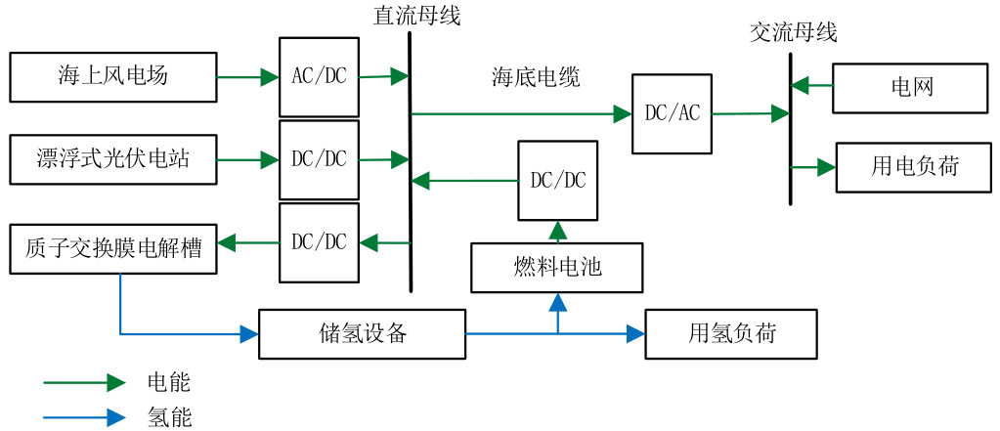  
图 A1 海上风光氢储一体化发电系统拓扑结构

Fig.A1 Topology of offshore wind-solar-hydrogen energy storage integrated energy system

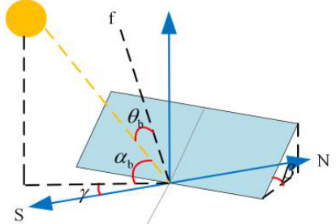  
图 A2 FPV 太阳入射角示意图

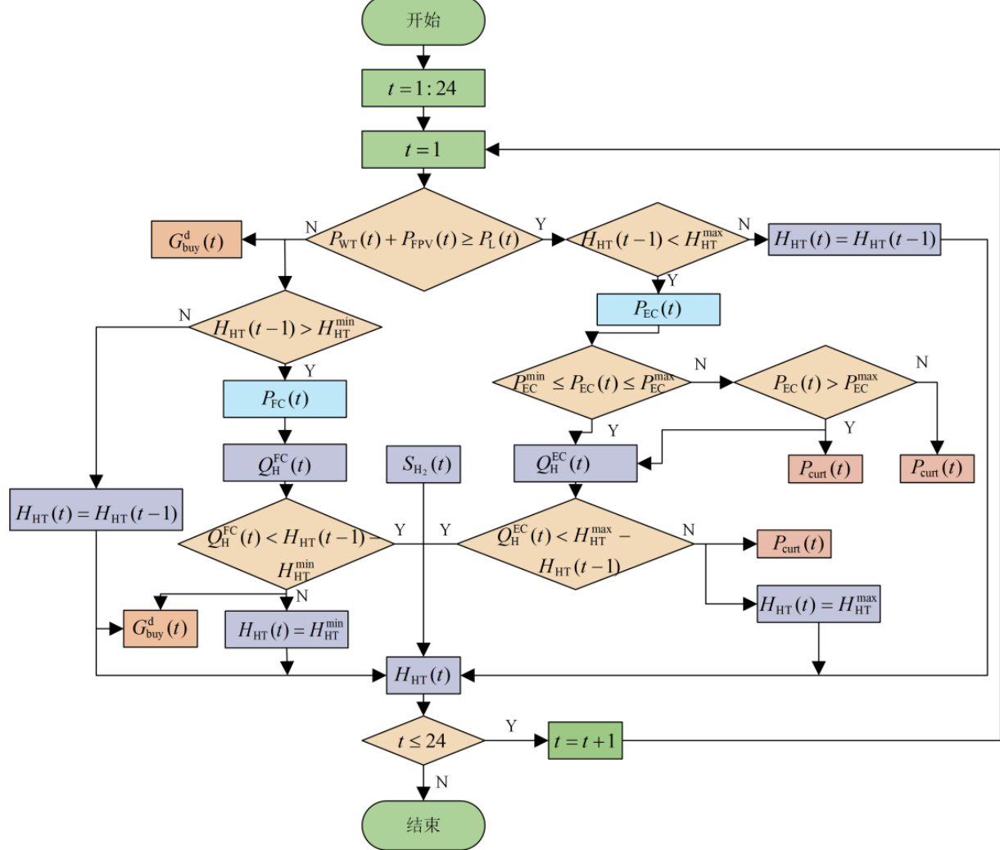  
Fig.A2 Schematic diagram of solar incidence angle of floating PV panels   
图 A3 氢储双向运行机制能量流过程  
Fig.A3 Bidirectional operation mechanism of hydrogen energy storage energy flow process

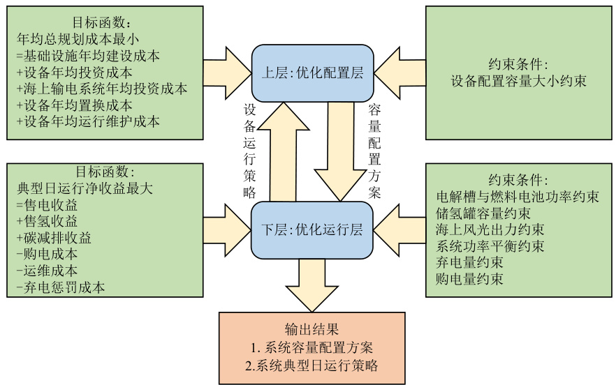  
图 A4 双层优化模型框架  
Fig.A4 Double-layer optimization modeling framework

# 约束条件

容量上下限约束：

$$
\begin{array} { r } { \left\{ \begin{array} { l l } { R _ { \mathrm { W T } } ^ { \mathrm { m i n } } \leq R _ { \mathrm { W T } } \leq R _ { \mathrm { W T } } ^ { \mathrm { m a x } } } \\ { R _ { \mathrm { F P V } } ^ { \mathrm { m i n } } \leq R _ { \mathrm { F P V } } \leq R _ { \mathrm { F P V } } ^ { \mathrm { m a x } } } \\ { R _ { \mathrm { E C } } ^ { \mathrm { m i n } } \leq R _ { \mathrm { E C } } \leq R _ { \mathrm { E C } } ^ { \mathrm { m a x } } } \\ { R _ { \mathrm { F C } } ^ { \mathrm { m i n } } \leq R _ { \mathrm { F C } } \leq R _ { \mathrm { F C } } ^ { \mathrm { m a x } } } \\ { R _ { \mathrm { H T } } ^ { \mathrm { m i n } } \leq R _ { \mathrm { H T } } \leq R _ { \mathrm { H T } } ^ { \mathrm { m a x } } } \end{array} \right. } \end{array}
$$

电解槽与 FC 启停与功率约束。

PEMEC 与 FC 在同一时刻不能同时开启，因此为保证系统的安全性，以及提高电解槽和 FC 的使用寿命，对其启停及功率约束如下:

$$
\begin{array} { r } { \left\{ ( 1 - \mu _ { \mathrm { E C } } ( t ) ) P _ { \mathrm { E C } } ^ { \mathrm { m i n } } ( t ) + \mu _ { \mathrm { F C } } ( t ) = 1 \right. \qquad } \\ { \left. ( 1 - \mu _ { \mathrm { E C } } ( t ) ) P _ { \mathrm { E C } } ^ { \mathrm { m i n } } \leq P _ { \mathrm { E C } } ( t ) \leq ( 1 - \mu _ { \mathrm { E C } } ( t ) ) P _ { \mathrm { E C } } ^ { \mathrm { m a x } } \right. } \\ { \left. ( 1 - \mu _ { \mathrm { F C } } ( t ) ) P _ { \mathrm { F C } } ^ { \mathrm { m i n } } \leq P _ { \mathrm { F C } } ( t ) \leq ( 1 - \mu _ { \mathrm { F C } } ( t ) ) P _ { \mathrm { F C } } ^ { \mathrm { m a x } } \right. } \end{array}
$$

式中： $\mu _ { \mathrm { E C } } ( t ) \setminus \ \mu _ { \mathrm { F C } } ( t )$ 为二进制变量， $\mu _ { \mathrm { E C } } ( t ) = 1$ 代表 $t$ 时刻 PEMEC 关闭， $\mu _ { \mathrm { { E C } } } ( t ) = 0$ 代表 $t$ 时刻 PEMEC 开启； $\mu _ { \mathrm { F C } } ( t ) = 0$ 代表 $t$ 时刻 FC 开启， $\mu _ { \mathrm { F C } } ( t ) = 1$ 代表 $t$ 时刻 FC 关闭。  
HT 容量约束。

对于 HT 而言，实际情况中罐内氢气无法全部排出，因此需要对 HT 容量下限进行约束；并且 HT 的氢气储存量不能超过其承受范围，因而也需要对 HT 的上限容量进行约束，模型如下：

$$
\left\{ \begin{array} { c } { H _ { \mathrm { H T } } ^ { \mathrm { m i n } } \leq H _ { \mathrm { H T } } ( t ) \leq H _ { \mathrm { H T } } ^ { \mathrm { m a x } } } \\ { H _ { \mathrm { H T } } ^ { \mathrm { m i n } } = 0 . 1 R _ { \mathrm { H T } } } \\ { H _ { \mathrm { H T } } ^ { \mathrm { m a x } } = 0 . 9 R _ { \mathrm { H T } } } \end{array} \right.
$$

式中： $H _ { \mathrm { H T } } ^ { \mathrm { m i n } }$ 、 $H _ { \mathrm { H T } } ^ { \mathrm { m a x } }$ 分别取 HT 容量的 $10 \%$ 和 $90 \%$ 。  
海上风光功率约束。

$$
\begin{array}{c} \left\{ 0 \leq P _ { \mathrm { W T } } ( t ) \leq P _ { \mathrm { W T } } ^ { \mathrm { m a x } }  \\ { 0 \leq P _ { \mathrm { F P V } } ( t ) \leq P _ { \mathrm { F P V } } ^ { \mathrm { m a x } } } \end{array} \right.
$$

功率平衡约束：

1）海上风光发电的有功平衡约束为：

$$
\begin{array} { c } { { P _ { \mathrm { W T } } ( t ) + P _ { \mathrm { F P V } } ( t ) { = } P _ { \mathrm { N } } ( t ) + P _ { \mathrm { E C } } ( t ) { + } P _ { \mathrm { c u r t } } ( t ) } } \\ { { P _ { \mathrm { N } } ( t ) = \operatorname* { m i n } \left\{ P _ { \mathrm { W T } } ( t ) + P _ { \mathrm { F P V } } ( t ) , P _ { \mathrm { L } } ( t ) \right\} } } \end{array}
$$

式中： $P _ { \mathrm { N } } ( t )$ 为 $t$ 时刻 WT 与 FPV 发电供负荷电量； $P _ { \mathrm { c u r t } } ( t )$ 为 $t$ 时刻系统弃电量。

2）负荷有功平衡约束可表示为：

$$
P _ { \mathrm { N } } ( t ) + P _ { \mathrm { F C } } ( t ) + G _ { \mathrm { b u y } } ^ { \mathrm { d } } ( t ) = P _ { \mathrm { L } } ^ { \mathrm { d } } ( t )
$$

弃电量约束。

$$
\sum _ { t = 1 } ^ { 2 4 } P _ { \mathrm { c u r t } } \left( t \right) \leq l \sum _ { t = 1 } ^ { 2 4 } \left( P _ { \mathrm { W T } } \left( t \right) + P _ { \mathrm { F P V } } \left( t \right) \right)
$$

式中：l 为弃电率上限，即一体化系统中可再生能源弃电量与可再生能源发电总量的比值最大值，取 $6 \%$ 。购电量约束：

$$
0 \leq G _ { \mathrm { b u y } } ^ { \mathrm { d } } ( t ) \leq G _ { \mathrm { b u y \_ m a x } } ^ { \mathrm { d } }
$$

式中： $G _ { \mathrm { b u y \_ m a x } } ^ { \mathrm { d } }$ 为典型日一体化系统购电量最大值。

# 附录 B

1)Circle 混沌映射

传统 DBO 算法中，初始种群是随机分布的，可能会无法保证种群均匀性。Circle 混沌映射种群多样性良好，在约束界限内分布均匀，且遍历性高，能使 DBO 更高效地探索整个搜索空间，并收敛到全局最优解。本文采用 Circle 混沌映射初始化种群，表达式为：

$$
x _ { k + 1 } = \mathrm { m o d } \Bigg ( x _ { i } + { \mathsf { b } } - \Bigg ( \frac { \mathbf { a } } { 2 \pi } \Bigg ) \mathrm { s i n } \big ( 2 \pi x _ { k } \big ) , 1 \Bigg )
$$

式中： $k$ 为解的维度；a、b为常数，分别取 0.5 与 0.2。

2)引入黄金正弦策略

在每次迭代中，采用黄金正弦策略，通过正弦函数对蜣螂个体进行动态搜索，增强算法的全局搜索能力，提高算法的遍历性。

$$
x _ { i } ( t + 1 ) \ = \ \left| \sin ( R _ { 1 } ) \right| x _ { i } ( t ) \ + R _ { 2 } \sin ( R _ { 1 } ) \left| x _ { 1 } x _ { i } ^ { \flat } ( t ) \ - x _ { 2 } x _ { i } ( t ) \right|
$$

式中： $x _ { i } ^ { \mathrm { b } } ( t )$ 表示个体 $i$ 在迭代过程中的最佳位置， $R _ { \mathrm { l } }$ 和 $R _ { 2 }$ 是随机选择的值， $R _ { 1 } \in \left[ 0 , 2 \pi \right]$ ， $R _ { 2 } \in \left[ 0 , \pi \right]$ 。

3)非线性边界收敛因子

在繁殖和觅食区域的边界处理策略约束中，原始 $R = 1 - t / T _ { \operatorname* { m a x } }$ 为线性收敛，难以表征繁殖与觅食时的复杂情况。在算法优化的早期阶段，需要强大的全局搜索能力，因此需要更宽的搜索范围。而在后期需要缩小搜索范围并增强算法的局部开发能力。因此，增强 DBO 算法的线性收敛因子 $R$ 。表达式为：

$$
R = 0 . 5 \left( \cos \left( \frac { \pi t } { T _ { \mathrm { m a x } } } \right) + 1 \right)
$$

为验证 IDBO 算法性能，采用 CEC2005 标准测试函数集中的单峰函数 F1-Sphere、F4-Schwefel2.21测试其收敛性，多峰函数 F9-Rastrigin、F10-Ackley 测试其搜索全局最优值能力。设置最大迭代次数为500，种群规模为 30。取 30 次测试结果的平均值和标准差作为评价指标，结果如表 B1 所示。图 B1 展示了 IDBO 算法与 DBO 算法、麻雀搜索算法（sparrow search algorithm, SSA）算法、鲸鱼优化（whaleoptimization algorithm，WOA）算法、灰狼优化（grey wolf optimizer，GWO）算法的对比结果。由表 B1及图 B1 可知，IDBO 算法在单峰、多峰测试函数中都展现出了优秀的求解性能，对比其他算法具有更强的收敛性以及全局搜索能力。

表 B1 IDBO 算法测试结果对比  
Table B1 Comparison of test results of IDBO algorithm   

<html><body><table><tr><td>算法</td><td>指标</td><td>F1</td><td>F4</td><td>F9</td><td>F10</td></tr><tr><td rowspan="2">SSA</td><td>平均值</td><td>5.9093E-27</td><td>1.0848E-06</td><td>8.2994E-08</td><td>4.7621E-06</td></tr><tr><td>标准差</td><td>1.3214E-26</td><td>5.2817E-06</td><td>4.0631E-07</td><td>1.5792E-05</td></tr><tr><td rowspan="2">GWO</td><td>平均值</td><td>2.4978E-29</td><td>4.2821E-07</td><td>0.53741</td><td>0.68427</td></tr><tr><td>标准差</td><td>2.758E-29</td><td>6.7001E-07</td><td>2.4622</td><td>3.7479</td></tr><tr><td rowspan="2">WOA</td><td>平均值</td><td>2.4281E-78</td><td>51.6166</td><td>0</td><td>3.9968E-15</td></tr><tr><td>标准差</td><td>2.7531E-78</td><td>24.5386</td><td>0</td><td>2.6389E-15</td></tr></table></body></html>

  
Fig.B1 Comparison diagram of convergence curve

图 B1 收敛曲线对比图

附录 C

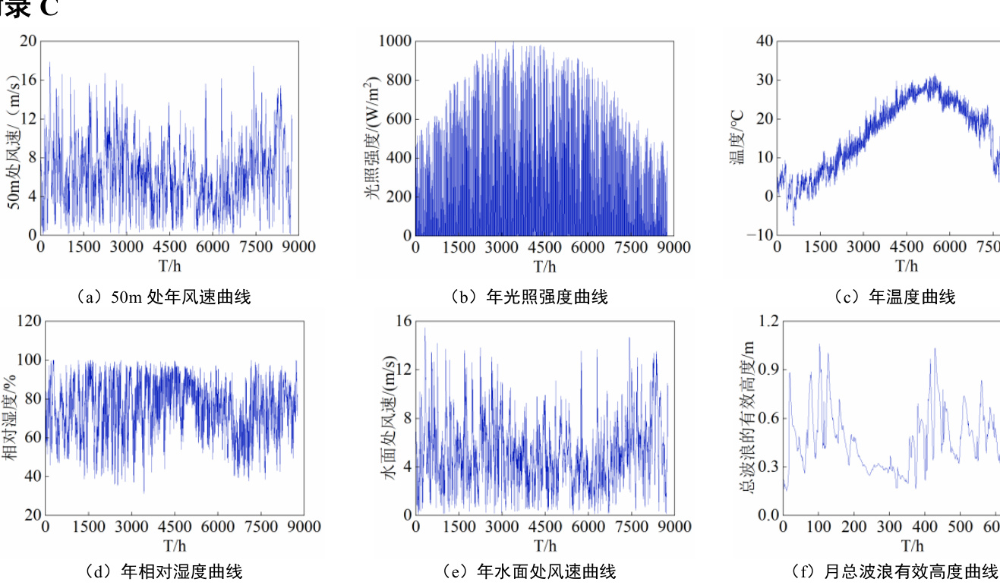

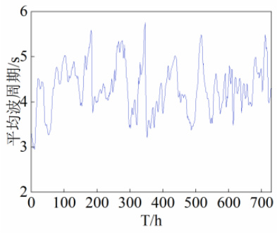  
图 C1  气象数据Fig.C1 Meteorological data

able C1 Economic parameters of equipment related to offshore wind-solar-hydrogen energy storage integrated energy system

表 C1 海上风光氢储一体化发电系统相关设备经济参数  

<html><body><table><tr><td>项目</td><td>购置 成本</td><td>单位</td><td>运维 成本</td><td>单位</td><td>置换 成本</td><td>单位</td></tr><tr><td>WT</td><td>11200</td><td>元/kW</td><td>0.029</td><td>元/kWh</td><td>-</td><td></td></tr><tr><td>FPV</td><td>7300</td><td>元/kW</td><td>0.0087</td><td>元/kWh</td><td></td><td></td></tr><tr><td>PEMEC</td><td>6500</td><td>元/kW</td><td>0.009</td><td>元/kWh</td><td>3450</td><td>元/kW</td></tr><tr><td>FC</td><td>7000</td><td>元/kW</td><td>0.1105</td><td>元/kWh</td><td>3840</td><td>元/kW</td></tr><tr><td>HT</td><td>4960</td><td>元/kg</td><td></td><td></td><td>2800</td><td>元/kg</td></tr><tr><td>输电系统</td><td>59.189</td><td>元/kW</td><td></td><td></td><td></td><td></td></tr></table></body></html>

表 C2 海上风光氢储一体化发电系统相关设备组件规格

Table C2 Module specifications of equipment related to offshore wind-solar-hydrogen energy storage integrated energy system   

<html><body><table><tr><td>设备</td><td colspan="2">参数</td><td>值</td></tr><tr><td rowspan="6"></td><td colspan="2">额定功率（kW)</td><td>5250</td></tr><tr><td colspan="2">风轮直径（m)</td><td>161</td></tr><tr><td colspan="2">切入风速(m/s)</td><td>3</td></tr><tr><td colspan="2">切出风速(m/s)</td><td>25</td></tr><tr><td colspan="2">额定风速(m/s)</td><td>10.7</td></tr><tr><td colspan="2">寿命 (年)</td><td>25</td></tr><tr><td rowspan="5">FPV</td><td colspan="2">额定功率（kW）</td><td>1</td></tr><tr><td colspan="2">组件转换效率（%)</td><td>81.5</td></tr><tr><td colspan="2">功率温度系数</td><td>0.00383</td></tr><tr><td colspan="2">寿命 (年)</td><td>25</td></tr><tr><td colspan="2">额定功率（kW) 制氢效率(%)</td><td>20</td></tr><tr><td rowspan="4"></td><td colspan="2">寿命 (年)</td><td>65</td></tr><tr><td colspan="2">额定功率（kW）</td><td>15</td></tr><tr><td colspan="2">发电效率（%)</td><td>20</td></tr><tr><td colspan="2">寿命 (年)</td><td>60</td></tr><tr><td rowspan="3" colspan="2">HT</td><td></td><td>5 6</td></tr><tr><td colspan="2">额定容量（kg) 寿命 (年)</td></tr><tr><td colspan="2">15</td></tr><tr><td colspan="4">表C3分时电价 Table C3 Time-sharing tariff</td></tr><tr><td rowspan="2">时段</td><td rowspan="2" colspan="2">时段类型</td><td rowspan="2">购电价 (元/kWh)</td><td>售电价</td></tr><tr><td>(元/kWh)</td></tr><tr><td>24:00-07:00</td><td>谷时段</td><td colspan="2">0.44</td></tr><tr><td>08:00-10:00、</td><td>平时段</td><td>0.67</td><td>0.51</td></tr><tr><td>14:00-18:00</td><td colspan="2"></td><td colspan="2"></td></tr><tr><td>11:00-13:00、 19:00-23:00</td><td colspan="2">峰时段</td><td>0.75</td></tr></table></body></html>

  
图 C2 典型日生成流程

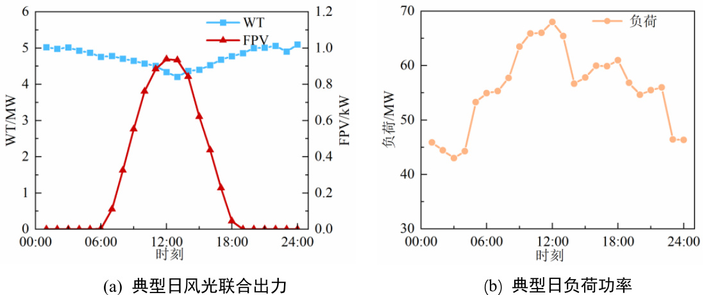  
Fig.C2 Typical day generation process   
图 C3 典型日电负荷以及海上风光联合出力功率Fig.C3 Typical day loads and combined offshore wind and solar output power

表 C4 仿真方案设计  

<html><body><table><tr><td colspan="5">Table C4 Simulation scheme design</td></tr><tr><td>方案</td><td>配置FPV</td><td>海上输 电系统 成本</td><td>海洋额 外运行 成本</td><td>售氢盈 利模式</td><td>返电调 峰模式</td></tr><tr><td>方案1</td><td>√</td><td></td><td></td><td></td><td>√</td></tr><tr><td>方案2</td><td>√</td><td>√</td><td></td><td></td><td>√</td></tr><tr><td>方案3</td><td></td><td>√</td><td></td><td>√</td><td>√</td></tr><tr><td>方案4</td><td>√</td><td>√</td><td>√</td><td>√</td><td>√</td></tr></table></body></html>

附录 D

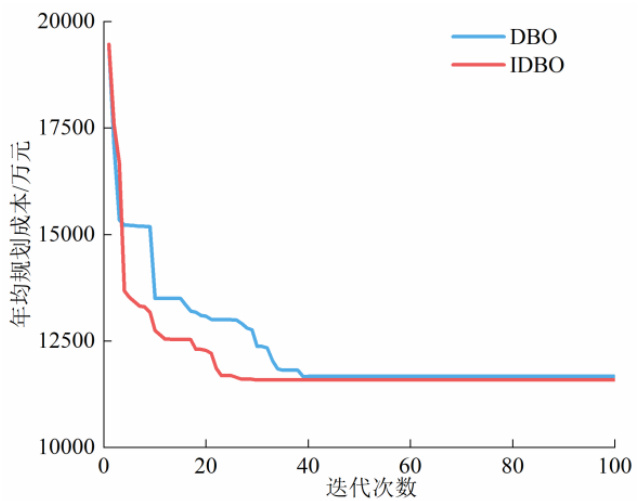  
图 D1 DBO 与 IDBO 算法收敛曲线

Table D1 Results of 30 simulation optimizations   

<html><body><table><tr><td>算法</td><td>平均迭代 次数/次</td><td>平均计算 时间/s</td><td>平均年均规 划成本/万元</td><td>平均典型日运 行净收益/万元</td></tr><tr><td>DBO</td><td>40.6</td><td>5.47</td><td>11659.61</td><td>83.11</td></tr><tr><td>IDBO</td><td>29.2</td><td>6.19</td><td>11544.44</td><td>83.37</td></tr></table></body></html>

对比图 D1 及表 D1，可以明显看出，在求解中，DBO 与 IDBO 算法所获得的平均年均规划成本分别为 11659.61 万元和 11544.44 万元，可见 DBO 算法只找到了局部最优解，而 IDBO 得到了适应度更好的解，提高了求解精度。在收敛速度上，IDBO 平均迭代 29.2 次后收敛得到最优解，相较于 DBO 平均迭代40.6 次，IDBO 迭代次数更少，收敛速度更快。在迭代计算时间方面，IDBO 算法与 DBO 算法的平均计算时间分别为 6.19s 和 5.47s，IDBO 算法虽能提高精度与收敛速度，但将增加迭代计算时间。

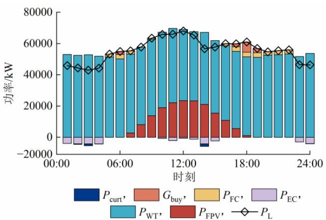  
Fig.D1 Convergence curves of DBO and IDBO algorithms表 D1 30 次仿真优化结果  
图 E1 方案 1 典型日运行策略  
Fig.E1 Typical day running stratEgy for scEnario 1

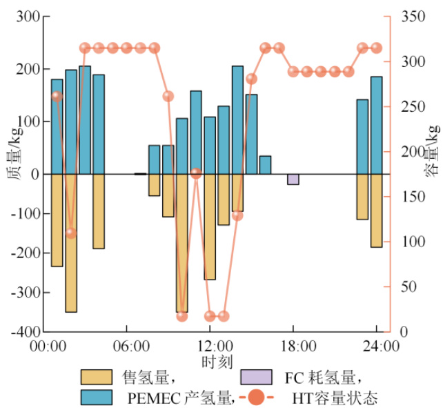  
图 E2 HT 容量变化图

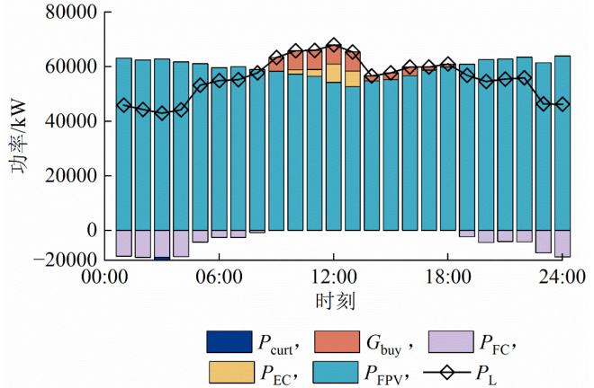  
Fig.E2 Diagram of hydrogEn storagE tank capacity variation   
图 E3 方案 3 的典型日运行策略

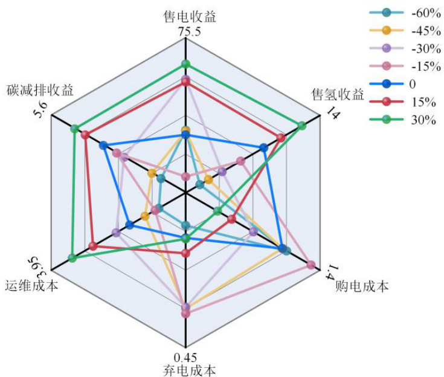  
Fig.E3 Typical day running stratEgy for scEnario 3   
图 E4 氢气价格对日运行净收益影响Fig. E4 HydrogEn pricE impact on nEt daily running gains